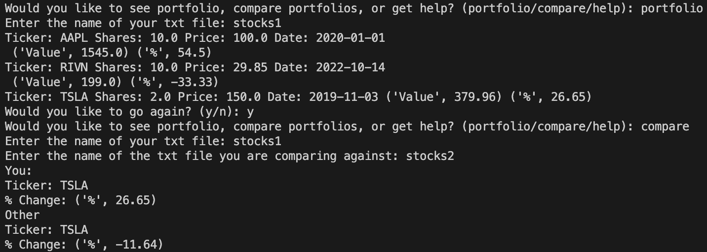

# Stock Portfolio Manager

This Stock Portfolio Manager is a Python program that helps you manage your stock investments and compare portfolios. It allows you to track stock details, calculate the value of your investments, and analyze the percentage change in stock prices.

## Features

- **Track Stocks:** Add stocks to your portfolio with details such as ticker symbol, number of shares, purchase price, and purchase date.

- **Calculate Value:** Calculate the current value of your portfolio based on the latest stock prices using Yahoo Finance data.

- **Analyze Performance:** Analyze the percentage change in stock prices since purchase.

- **Compare Portfolios:** Compare your portfolio with another portfolio to see how they differ in terms of stock performance.

## Getting Started

1. Clone the repository or download the code.

2. Install the required Python packages using pip:

   ```bash
   pip install yfinance matplotlib

   ```

3. Run the program by executing the `main.py` file.

4. Follow the on-screen prompts to manage your portfolio, calculate values,

### Usage

#### Portfolio Management

1. Create a text file (e.g., `portfolio.txt`) with your stock holdings in the following format:

   ```plaintext
   ticker,shares,price,date
   AAPL,10,100,2020-01-01
   MSFT,20,150,2021-03-15

   ```

2. Run the program by executing the `main.py` file.

3. Follow the on-screen prompts to manage your portfolio, calculate values, and compare portfolios.

**Portfolio Comparison**

1. Create a text file for a second portfolio (e.g., `portfolio2.txt`) using the same format as mentioned above.

2. Run the program by executing the `main.py` file.

3. Select the "compare" option from the program menu.

4. Follow the prompts to compare two portfolios.

## Screenshots

Here are some screenshots of the program in action:




